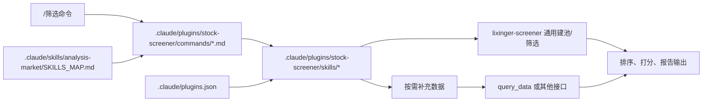

## User Requirements

- 在 `.claude/plugins` 下新增一个“股票筛选”插件分组，作为可扩展的策略筛选容器；当前首批策略包括：`undervalued-stock-screener`、`high-dividend-strategy`、`quant-factor-screener`、`small-cap-growth-identifier`、`bse-selection-analyzer`、`esg-screener`，但文档结构不能写死为固定数量。
- 为这组策略补充一整套 command 命令，用户可直接通过命令进入对应筛选流程；后续新增策略时也应按同样模式继续扩展。
- `.claude/skills/lixinger-screener` 的定位是通用股票筛选与数据查询能力，本次方案只复用它作为建池/筛选底层，不对其做无关的大改动。
- 当前这批策略目录按用户要求采用直接 `mv` 迁移到新插件目录的方式设计，而不是首轮保留旧路径兼容。
- 若策略在候选池之外还需要更多数据，允许按需继续调用其他接口或数据源，不要求所有后续取数都收敛到 `lixinger-screener`。
- 当前阶段仅需要设计文档，不直接执行迁移或改动代码。

## Product Overview

- 形成一个独立、清晰、可持续扩展的股票筛选插件入口，把分散的策略筛选能力收拢为统一目录、统一命令入口和统一建池方式。
- 插件层关注“策略组织”和“用户入口”；`lixinger-screener` 保持“通用筛选/查询底座”定位，两者职责分离。
- 首批先承接当前已有策略，后续可以持续向该插件内增加新的股票策略筛选能力，而不需要再次调整整体架构。

## Core Features

- 股票筛选插件分组：作为未来新增股票策略的统一容器。
- 首批策略迁移：将当前指定的策略直接移动到新插件目录。
- Command 入口集：每个策略提供独立命令说明与触发入口，并预留未来策略继续新增的模式。
- 通用建池层：优先通过 `lixinger-screener` 完成股票池筛选与基础查询。
- 补充数据层：在策略需要更细数据时，允许继续使用其他接口补数。
- 例外处理机制：对 ESG 等无法仅靠筛选器完成的维度，保留补充数据与兜底方案。

## Tech Stack Selection

- **插件文档层**：延续现有 `.claude/plugins/*` 结构，使用 `README.md`、`.claude-plugin/plugin.json`、`commands/*.md`、`skills/` 的组织方式；结构参考已存在的 `valuation` 与 `stock-crawler` 插件。
- **筛选执行层**：复用现有 `.claude/skills/lixinger-screener`，保持其作为通用股票筛选/数据查询能力的定位；优先使用其现有 `request` / `browser` 双实现与统一输入 schema，不新增无关职责。
- **补充数据层**：继续复用 `.claude/plugins/query_data` 与各策略现有参考文档；对 ESG 等 `lixinger-screener` 无法直接覆盖的维度，保留混合数据方案。

## Implementation Approach

### 方法与整体策略

建议新增聚合型插件 `.claude/plugins/stock-screener/`，把“发现入口、命令入口、能力说明、策略 skill”统一收拢到插件目录中；当前首批策略采用直接迁移方式进入该插件；建池阶段统一优先复用 `lixinger-screener`，后续明细补数按策略需要调用其他接口。

### 关键技术决策

1. **插件做成可扩展策略容器，不写死固定策略数量**

- `stock-screener` 的 README、目录结构和命令组织按“策略集合”设计，而不是按当前首批数量设计。
- 当前仅先落地用户指定的首批策略；后续新增策略时，只需继续在 `commands/` 和 `skills/` 下追加目录与文档。

2. **当前首批策略按用户要求直接 `mv` 到插件目录**

- 不再以“旧 skill 路径保留兼容”为首要方案。
- 设计上采用直接迁移：把当前策略目录移动到 `.claude/plugins/stock-screener/skills/` 下，并同步更新 `SKILLS_MAP.md`、`plugins.json` 与相关引用。
- 迁移完成后，新插件目录成为这些策略的主路径。

3. **`lixinger-screener` 保持通用底座定位，尽量零侵入复用**

- `lixinger-screener` 主要负责股票池筛选、条件表达、自然语言筛选和基础导出。
- 新插件只依赖它的稳定输入/输出方式，不把策略逻辑反向塞进 `lixinger-screener`。
- 除非后续发现明确缺口，否则不对 `lixinger-screener` 做与本次插件迁移无关的结构调整。

4. **分层处理“筛选建池”和“策略补数”**

- 建池阶段：优先走 `lixinger-screener`。
- 策略分析阶段：只对入围名单按需调用其他接口补充财务、分红、治理、ESG、流动性等数据。
- 这样能保持 `lixinger-screener` 通用，同时保留各策略在后续取数上的灵活性。

### Performance & Reliability

- **候选池阶段**：默认使用 `request` 版，依赖分页批量返回，避免大量逐股请求。
- **调试兜底**：`browser` 版只用于自然语言试错、字段映射回归或 request 版异常时排障，不作为日常主链路，也不改变其产品定位。
- **补数阶段**：额外接口只对入围名单按需调用，避免全市场深拉。
- **ESG 特例**：ESG 评分与争议等维度走补充数据源，候选池仍可先由 screener 负责。

## Implementation Notes

- 直接复用 `valuation/README.md`、`valuation/.claude-plugin/plugin.json`、`valuation/commands/*.md` 的格式约定，不引入新的 plugin 文档样式。
- `stock-screener` 插件文档要写成“可持续新增策略”的模式，不把当前首批策略数量固化为长期结构。
- `lixinger-screener` 只作为通用筛选与数据查询能力复用，不在本次设计里承担策略编排职责。
- 策略若需要额外数据，可继续走其他 API；不要求为了统一而强行把所有取数都改到 `lixinger-screener`。
- 当前首批策略中：
- `China-market_undervalued-stock-screener/references/data-queries.md` 已切到 `lixinger-screener`。
- `high-dividend-strategy`、`quant-factor-screener`、`small-cap-growth-identifier`、`bse-selection-analyzer` 仍主要依赖 `query_tool.py`，后续设计中应调整为“screener 建池 + 其他接口补数”。
- `esg-screener` 已明确理杏仁 ESG 接口缺口，需要保留混合数据方案。
- Command 文档建议统一为：说明适用场景、参数提示、先构建候选池、再调用对应策略 skill、最后输出结构化结果。
- 首轮迁移按用户要求直接移动目标策略目录，不额外保留旧目录作为长期兼容层。

## Architecture Design

### 系统结构

- **Plugin 入口层**：`README.md` 汇总策略，`commands/*.md` 提供直接调用入口。
- **Strategy Skill 层**：插件内 `skills/*` 负责参数解释、策略约束、打分逻辑和报告生成。
- **通用建池层**：`lixinger-screener` 负责股票池筛选与基础查询。
- **补充数据层**：`query_data` 或其他接口负责策略所需的补充字段。
- **索引层**：`SKILLS_MAP.md` 与 `.claude/plugins.json` 指向迁移后的新路径。

## Directory Structure

### Directory Structure Summary

推荐目标态是在 `.claude/plugins/stock-screener/` 新增统一插件入口，并把当前首批策略直接迁移进去；同时保留该插件继续新增更多策略的扩展空间。

- `.claude/plugins/stock-screener/README.md` [NEW]  
插件总览文档。说明这是可扩展的股票策略筛选插件，展示当前已接入策略、命令入口与通用建池规则。

- `.claude/plugins/stock-screener/.claude-plugin/plugin.json` [NEW]  
插件 manifest。沿用现有最小字段结构，声明插件名称、版本、描述、作者。

- `.claude/plugins/stock-screener/commands/undervalued-stock-screener.md` [NEW]  
低估值筛选命令入口。

- `.claude/plugins/stock-screener/commands/high-dividend-strategy.md` [NEW]  
高股息筛选命令入口。

- `.claude/plugins/stock-screener/commands/quant-factor-screener.md` [NEW]  
多因子筛选命令入口。

- `.claude/plugins/stock-screener/commands/small-cap-growth-identifier.md` [NEW]  
小盘成长筛选命令入口。

- `.claude/plugins/stock-screener/commands/bse-selection-analyzer.md` [NEW]  
北交所筛选命令入口。

- `.claude/plugins/stock-screener/commands/esg-screener.md` [NEW]  
ESG 筛选命令入口。

- `.claude/plugins/stock-screener/commands/<future-strategy>.md` [FUTURE]  
未来新增策略的命令入口扩展位。

- `.claude/plugins/stock-screener/skills/undervalued-stock-screener/` [MOVE FROM `.claude/skills/China-market_undervalued-stock-screener/`]  
低估值策略 skill 新位置。

- `.claude/plugins/stock-screener/skills/high-dividend-strategy/` [MOVE FROM `.claude/skills/China-market_high-dividend-strategy/`]  
高股息策略 skill 新位置。

- `.claude/plugins/stock-screener/skills/quant-factor-screener/` [MOVE FROM `.claude/skills/China-market_quant-factor-screener/`]  
量化因子策略 skill 新位置。

- `.claude/plugins/stock-screener/skills/small-cap-growth-identifier/` [MOVE FROM `.claude/skills/China-market_small-cap-growth-identifier/`]  
小盘成长策略 skill 新位置。

- `.claude/plugins/stock-screener/skills/bse-selection-analyzer/` [MOVE FROM `.claude/skills/China-market_bse-selection-analyzer/`]  
北交所选股策略 skill 新位置。

- `.claude/plugins/stock-screener/skills/esg-screener/` [MOVE FROM `.claude/skills/China-market_esg-screener/`]  
ESG 筛选策略 skill 新位置。

- `.claude/plugins/stock-screener/skills/<future-strategy>/` [FUTURE]  
未来新增股票策略 skill 的扩展位。

- `.claude/skills/lixinger-screener/` [REUSE AS-IS]  
保留原位置与定位，作为通用股票筛选/数据查询底座，不做无关结构迁移。

- `.claude/skills/analysis-market/SKILLS_MAP.md` [MODIFY]  
把原“估值选股”分组更新为指向 `stock-screener` 插件或其首批策略，文案按可扩展策略集合写法调整。

- `.claude/plugins.json` [MODIFY]  
同步更新迁移后的 skill 路径与插件入口信息，确保发现链路指向新目录。

- `.claude/plugins/stock-screener/skills/*/references/data-queries.md` [MODIFY]  
统一改成“优先 screener 建池，后续按策略需要补数”的写法；其中 ESG 保留混合数据说明。

## Agent Extensions

### SubAgent

- **code-explorer**
- Purpose: 核对首批策略、索引文件、插件范式和迁移引用链路。
- Expected outcome: 产出准确的迁移影响面清单，避免遗漏 `SKILLS_MAP.md`、`plugins.json` 或策略内引用。

### Skill

- **skill-creator**
- Purpose: 统一新 plugin README、commands 文档和迁移后 strategy skill 文档的写法与结构。
- Expected outcome: 形成与现有 skill/plugin 体系一致、且支持后续持续扩展的文档模板。

### Skill

- **playwright**
- Purpose: 为 `lixinger-screener` 的 browser 兜底链路设计验证步骤，尤其用于字段映射漂移和自然语言筛选回归。
- Expected outcome: 形成 request 默认、browser 兜底、且不侵入 `lixinger-screener` 定位的验证方案。