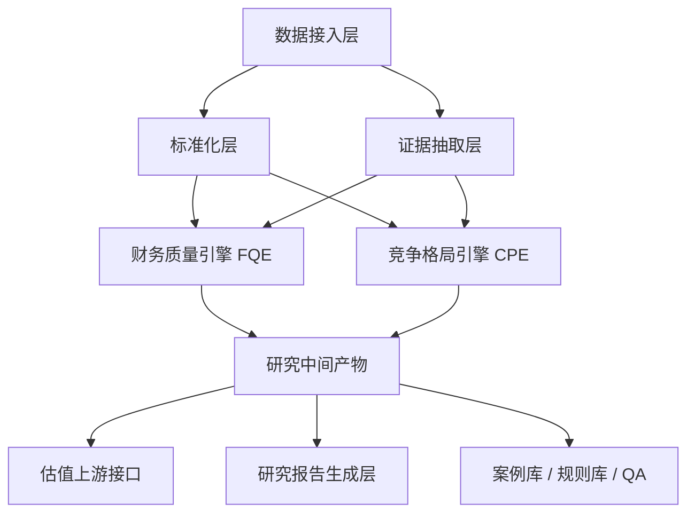

# 深度研究产品设计文档

## 1. 文档目标

本文档用于指导两个深度研究方向的产品设计与开发落地：

1. **财务质量 / 法证会计 / QoE**
2. **竞争格局 / 同业结构 / 行业经济学**

目标不是再做两个“取数 + 填模板”的 skill，而是沉淀两套可持续迭代、可复用、可校验的分析系统，并作为后续估值、投研、组合决策的上游能力。

---

## 2. 为什么选这两个方向

这两个方向同时满足以下条件：

- **非常常用**：几乎所有严肃的公司研究、投前分析、持仓复盘都会反复触达。
- **可以做深**：有稳定对象模型、可迭代规则库、可积累案例库，不依赖短期热点。
- **能形成证据链**：核心不是观点，而是“结论如何从数据、调整、假设和比较中推出来”。
- **是估值上游**：财务质量回答“利润靠不靠谱”，竞争格局回答“为什么应有溢价/折价”。

这意味着它们不应被定义为两个孤立的 skill，而应被定义为一个深度研究系统的两个核心引擎。

---

## 3. 产品定位

### 3.1 总体定位

建设一个**深度研究工作台**，先聚焦 A 股非金融公司，逐步扩展到港股和美股。系统由两个主引擎组成：

- **FQE: Financial Quality Engine**
  关注报告利润真实性、现金流质量、会计调整、资产负债表风险、治理可信度。
- **CPE: Competitive Positioning Engine**
  关注公司在行业中的位置、护城河、定价权、成本优势、利润池、产业链关系和周期位置。

最终，这两个引擎输出可供估值直接使用的上游结论：

- 可持续利润口径
- 风险调整后的增长与回报假设
- 溢价/折价的解释框架

### 3.2 一句话定义

- **财务质量引擎**：回答“这家公司的报表能不能信，它真实的盈利能力大概是什么样”。
- **竞争格局引擎**：回答“这家公司在行业里为什么能赚钱，未来这种赚钱方式能持续多久”。

---

## 4. 产品原则

### 4.1 以证据链为中心，而非模板为中心

系统必须优先沉淀：

- 数据来源
- 分析中间层
- 调整项
- 规则命中
- 结论置信度

报告模板只是最后一层表现，不是系统核心。

### 4.2 将“事实”“推断”“结论”分层

每条结论都要清晰区分：

- **事实**：原始数据、公告、财报披露、可验证数值
- **推断**：根据规则、比较和经验得出的中间判断
- **结论**：研究员或系统给出的业务结论与投资含义

### 4.3 明确不确定性

如果输入缺失、口径不可比、行业数据不足、关系推断置信度低，系统必须显式标注，而不是默认补齐。

### 4.4 系统可累积

每做完一家公司/行业，系统都应沉淀：

- 新规则
- 新红旗案例
- 新行业映射
- 新调账模式
- 新对标框架

这样系统会随案例库增长而变强。

### 4.5 先窄后深

第一阶段只做：

- A 股
- 非金融公司
- 年报 / 中报 / 季报为核心输入
- 典型制造业、消费、科技硬件、新能源、医药等行业

不在早期同时覆盖银行、保险、券商、地产开发、强资源周期和大量海外公司。

---

## 5. 非目标

以下内容不作为本阶段主目标：

- 市场概览、热点追踪、宽度监控、资金流播报
- 单纯的公告汇总与情绪监控
- 纯信号驱动的短线择时
- “一句话看多/看空”的轻量摘要工具
- 自动替代研究员做最终投资决策

这些能力可以作为补充输入，但不构成本产品的核心差异化。

---

## 6. 用户与核心场景

### 6.1 目标用户

- 做个股深度研究的分析师
- 有持仓、需要持续复盘公司的投资者
- 做估值模型、需要高质量上游假设的研究用户
- 需要理解行业位置与竞争优势的组合经理

### 6.2 核心场景

1. **新覆盖公司研究**
   - 我第一次看这家公司，先判断财务质量和竞争位置。

2. **财报后复盘**
   - 这次财报哪些变化是真改善，哪些只是会计和节奏变化。

3. **估值前置清洗**
   - 在做 DCF / comps 之前，先做 normalized earnings 和 business quality 判断。

4. **同业比较与溢价解释**
   - 为什么 A 公司应当比 B 公司有更高的估值倍数。

5. **已有持仓的持续跟踪**
   - 我持有的公司财务质量是否在恶化，竞争优势是否在削弱。

---

## 7. 总体架构



### 7.1 分层说明

#### 数据接入层

负责拉取与收集：

- 财务报表与基础市场数据
- 公司公告、审计信息、治理事件
- 行业分类、行业指标、景气指标
- 产业链关系与外部行业资料

#### 标准化层

负责：

- 统一期间口径
- 统一币种和单位
- 统一公司、行业、产品、产能等实体
- 形成可计算的结构化表

#### 证据抽取层

负责：

- 从财报附注、公告、文本资料中抽取结构化证据
- 对证据做来源标注与置信度标注

#### 分析引擎层

- FQE 输出 normalized earnings、adjustment ledger、red flags、business quality verdict
- CPE 输出 market map、peer clusters、profit pool map、competitive verdict

#### 中间产物层

不直接拼报告，而是先形成稳定的 JSON / 表格中间结构，供估值、报告、问答复用。

---

## 8. 统一对象模型

两个引擎应共享一套基础对象模型。

### 8.1 基础实体

| 对象 | 说明 |
|------|------|
| `Company` | 公司主实体 |
| `ReportingPeriod` | 报告期，含年报/中报/季报 |
| `FinancialFact` | 结构化财务事实 |
| `MarketFact` | 市值、价格、成交、估值倍数等 |
| `EvidenceItem` | 任意可引用证据，含来源与置信度 |
| `PeerCompany` | 可比公司实体 |
| `IndustryNode` | 行业节点或产业链节点 |
| `ResearchIssue` | 红旗、疑点、风险项 |
| `AdjustmentItem` | 规范化利润与资产负债表调整项 |
| `Verdict` | 模块结论，含分数、等级、解释 |

### 8.2 关键设计要求

- 所有对象必须有 `source`, `as_of_date`, `confidence`, `notes`
- 同一结论允许引用多个 `EvidenceItem`
- 所有调整项必须可回溯到原始口径

---

## 9. 主线一：财务质量 / 法证会计 / QoE

## 9.1 产品目标

不是做“财务指标解释器”，而是建立一套**财务真实性与盈利质量判断系统**。

系统最终要回答 5 个问题：

1. 报告利润是否可信
2. 现金流是否支持利润
3. 报表中有哪些必须调整的项目
4. 公司的真实盈利能力和真实资产质量如何
5. 最终可否形成可信的 normalized earnings 口径

## 9.2 核心输出

财务质量引擎应输出以下核心产物：

1. **Normalized Earnings Bridge**
   - 从报告净利润到规范化利润的桥接

2. **Adjustment Ledger**
   - 所有调整项清单、金额、方向、理由、证据来源

3. **Red Flag Register**
   - 红旗项、严重度、证据、触发规则、待验证事项

4. **Cash Reality Report**
   - 经营现金流、自由现金流、营运资本占用、利润现金转化

5. **Balance Sheet Risk Map**
   - 商誉、应收、存货、其他应收款、短债压力、表外义务

6. **Governance Trust Overlay**
   - 审计师、财务高管、重述、监管问询、关联交易、股权质押

7. **Business Quality Verdict**
   - 质量等级、核心问题、最关键支持证据与最关键不确定性

## 9.3 分析流水线

### Step F1: 数据完备性检查

检查是否具备：

- 至少 5 年财务报表
- 近 8 个季度核心指标
- 审计意见
- 主要附注和重大事项

缺失时系统进入降级模式，并记录影响范围。

### Step F2: 期间与口径标准化

处理：

- 年报、季报、TTM、LTM 对齐
- 一次性项目与持续经营项目拆分
- 可比口径调整
- 会计准则变化导致的口径跳变

### Step F3: 盈利质量分析

重点模块：

- 5 因子杜邦
- 应计质量
- 扣非 vs 报告利润
- 政府补助依赖
- 季度分布异常
- 收入确认与应收联动

### Step F4: 现金真实性分析

重点检查：

- 经营现金流 vs 净利润
- 自由现金流覆盖
- 营运资本拉动/拖累
- 现金与存货、应收、预收的联动逻辑
- 现金流异常但利润稳定的情况

### Step F5: 资产负债表风险分析

重点检查：

- 商誉与无形资产风险
- 应收账款、票据、其他应收款风险
- 存货积压与跌价风险
- 有息负债结构与偿债压力
- 对外担保、表外义务、或有事项

### Step F6: 分部与资本配置分析

重点检查：

- 分部利润质量差异
- 分部资本消耗情况
- 亏损业务是否由优质业务补贴
- Capex 是否产生有效回报
- 管理层是否在重复错误配置资本

### Step F7: 治理与可信度叠加

重点检查：

- 审计意见变化
- 财务总监更替
- 监管问询
- 关联交易
- 大股东质押与减持
- 历史重述或会计估计变更

### Step F8: 形成规范化利润与最终结论

输出：

- 报告利润
- 调整后利润
- 现金支撑后的利润可信度
- 核心红旗
- 最终 business quality verdict

## 9.4 财务质量对象模型

### 9.4.1 AdjustmentItem

建议字段：

```json
{
  "id": "adj_nonrecurring_gain_2024",
  "period": "2024FY",
  "category": "non_recurring",
  "sub_category": "asset_disposal_gain",
  "direction": "subtract",
  "amount": 320.5,
  "currency": "CNY",
  "unit": "million",
  "impact_area": "net_income",
  "reason": "处置收益不应纳入持续经营利润",
  "source_refs": ["annual_report_note_12", "income_statement_line_27"],
  "confidence": 0.88
}
```

### 9.4.2 ResearchIssue

建议字段：

```json
{
  "id": "flag_receivable_growth_2024q4",
  "severity": "high",
  "category": "revenue_quality",
  "title": "应收增速显著快于收入增速",
  "description": "2024Q4 应收账款同比增长 42%，同期收入增长 11%",
  "rule_id": "fq_rev_001",
  "evidence_refs": ["bs_ar_2024q4", "ps_revenue_2024q4"],
  "possible_explanations": ["渠道压货", "账期拉长", "确认节奏前置"],
  "status": "open"
}
```

### 9.4.3 FQE 输出契约

```json
{
  "company": "600519",
  "as_of_date": "2026-03-24",
  "normalized_earnings": {
    "reported_net_income": 0,
    "adjusted_net_income": 0,
    "adjustments": []
  },
  "scores": {
    "earnings_quality": 0,
    "cash_quality": 0,
    "balance_sheet_quality": 0,
    "governance_quality": 0,
    "overall": 0
  },
  "red_flags": [],
  "key_strengths": [],
  "key_uncertainties": [],
  "verdict": {
    "grade": "A/B/C/D",
    "summary": "",
    "confidence": 0
  }
}
```

## 9.5 评分框架

建议采用“维度评分 + 红旗扣分 + 研究员覆盖”的混合机制。

| 维度 | 权重 | 说明 |
|------|------|------|
| 盈利质量 | 30% | 报告利润可信度、一次性项目、收入质量 |
| 现金质量 | 25% | 经营现金流、自由现金流、营运资本 |
| 资产负债表质量 | 25% | 应收、存货、商誉、负债、表外风险 |
| 治理可信度 | 20% | 审计、监管、关联交易、质押、重述 |

额外机制：

- 高严重度红旗触发总分封顶
- 若关键输入缺失，则总分上限受限
- 若 normalized earnings 不可可靠估算，则 verdict 不能高于 B

## 9.6 红旗规则库

规则库应按类别管理：

- 收入质量
- 现金流质量
- 营运资本
- 资产质量
- 负债结构
- 治理与审计
- A 股特有风险

规则结构建议：

```json
{
  "rule_id": "fq_cash_003",
  "category": "cash_quality",
  "name": "连续低现金转化",
  "trigger": "ocf_to_net_income < 0.8 for 3 consecutive years",
  "severity": "high",
  "default_message": "经营现金流连续多年无法支撑报告净利润",
  "review_questions": [
    "是否存在渠道压货",
    "是否存在应收持续扩张",
    "是否存在一次性利润"
  ]
}
```

## 9.7 必须避免的降级

财务质量系统不能只停留在：

- 机械算几个比率
- 输出一组打分
- 列举常见风险词

它必须有能力输出：

- 调整项台账
- 调整逻辑
- 红旗证据
- 最终规范化利润口径

这才是 QoE 的核心壁垒。

---

## 10. 主线二：竞争格局 / 同业结构 / 行业经济学

## 10.1 产品目标

不是做“同行对比表”或“产业链模板图”，而是建立一套**解释企业经济地位与估值溢价来源的分析系统**。

系统最终要回答 6 个问题：

1. 公司究竟处于什么市场和产业链位置
2. 这个市场的利润池如何分布
3. 公司靠什么赚钱，赚钱方式是否可持续
4. 它为什么比同行更强或更弱
5. 它当前处于产业周期的什么位置
6. 它应当享受溢价、折价，还是均值回归估值

## 10.2 核心输出

竞争格局引擎应输出以下产物：

1. **Market Structure Map**
   - 市场定义、细分赛道、关键玩家、集中度

2. **Peer Cluster Map**
   - 真正可比的公司群组，不只是行业分类同类

3. **Value Chain / Industry Chain Map**
   - 上游、中游、下游，关键约束环节与传导路径

4. **Profit Pool Analysis**
   - 谁在赚利润、谁在承担资本开支、谁在被压价

5. **Competitive Advantage Assessment**
   - 定价权、成本优势、规模效应、品牌、渠道、技术、切换成本

6. **Cycle and Regime Assessment**
   - 行业所处周期位置、产能状态、价格弹性、需求韧性

7. **Strategic Verdict**
   - 公司竞争地位、变化方向、最主要的溢价或折价来源

## 10.3 分析流水线

### Step C1: 定义“比较空间”

必须先明确：

- 比的是哪个细分市场
- 哪些公司是真正的竞争对手
- 哪些公司只是名义上同一行业，实质不可比

例如：

- 白酒不是“食品饮料整体”，而应区分高端、次高端、大众酒
- 动力电池不应与整车、上游锂矿混在同一比较层

### Step C2: 建立行业与价值链图谱

需要形成结构化图谱：

- 核心产品 / 服务
- 上游关键投入
- 下游关键客户
- 关键环节利润率
- 成本与价格传导路径

### Step C3: 构建真正的 peer clusters

peer 不按申万行业名义分组，而按以下维度聚类：

- 产品与商业模式
- 收入结构
- 毛利结构
- 终端客户
- 成长阶段
- 资本强度
- 监管环境

### Step C4: 做市场结构与利润池分析

重点分析：

- 市场份额与份额变化
- 行业集中度变化
- 龙头与尾部利润率差异
- 产业链各环节的利润留存能力
- 行业是规模驱动、品牌驱动还是资源驱动

### Step C5: 做竞争优势拆解

竞争优势必须拆成清晰可评分维度：

- 定价权
- 成本曲线位置
- 规模效应
- 品牌壁垒
- 渠道控制
- 技术壁垒
- 切换成本
- 网络效应
- 监管牌照

### Step C6: 做周期与战略位置判断

重点分析：

- 行业产能周期
- 库存周期
- 价格周期
- 资本开支周期
- 需求弹性
- 替代风险
- 行业结构变化

### Step C7: 输出溢价/折价解释

最终必须落成：

- 为什么该公司应高于同行估值
- 为什么该公司不应享受高倍数
- 哪些优势可持续
- 哪些优势只是周期或景气错觉

## 10.4 竞争格局对象模型

### 10.4.1 IndustryNode

```json
{
  "id": "battery_cell_midstream",
  "name": "动力电池电芯",
  "level": "segment",
  "parent_id": "new_energy_vehicle_chain",
  "economics": {
    "gross_margin_range": [0.12, 0.28],
    "capex_intensity": "high",
    "concentration": "medium_high"
  }
}
```

### 10.4.2 CompetitiveClaim

```json
{
  "id": "claim_pricing_power_001",
  "company": "300750",
  "dimension": "pricing_power",
  "claim": "公司在高端客户中具备阶段性议价能力",
  "supporting_evidence": [
    "gross_margin_outperformance_2023_2025",
    "market_share_stable_under_raw_material_shock",
    "premium_customer_mix"
  ],
  "confidence": 0.74,
  "status": "supported"
}
```

### 10.4.3 CPE 输出契约

```json
{
  "company": "300750",
  "as_of_date": "2026-03-24",
  "market_definition": {
    "segment": "",
    "geography": "",
    "peer_clusters": []
  },
  "scores": {
    "market_position": 0,
    "pricing_power": 0,
    "cost_advantage": 0,
    "barrier_strength": 0,
    "cycle_position": 0,
    "overall": 0
  },
  "profit_pool": {
    "attractive_nodes": [],
    "pressured_nodes": []
  },
  "major_claims": [],
  "risks": [],
  "verdict": {
    "position": "leader/challenger/follower/niche",
    "premium_discount_view": "",
    "confidence": 0
  }
}
```

## 10.5 评分框架

| 维度 | 权重 | 说明 |
|------|------|------|
| 市场地位 | 20% | 份额、份额变化、行业角色 |
| 定价权 | 20% | 毛利稳定性、提价能力、客户结构 |
| 成本优势 | 20% | 成本曲线、规模效应、运营效率 |
| 壁垒强度 | 20% | 品牌、技术、渠道、切换成本、牌照 |
| 周期位置与脆弱性 | 20% | 供需、产能、价格、景气与波动性 |

注意：

- 周期行业的高盈利不自动等于高质量竞争优势
- 静态份额领先不自动等于定价权
- 高估值不作为竞争优势证据

## 10.6 证据类型

竞争格局系统必须允许结构化和半结构化证据共存。

### 结构化证据

- 市场份额
- 毛利率
- ROIC
- 资本开支强度
- 客户集中度
- 价格与成本变化
- 行业产量、库存、开工率

### 半结构化证据

- 年报业务描述
- 管理层讨论与展望
- 重大客户与供应商变化
- 产能扩张公告
- 行业协会数据
- 监管政策文件

### 推断性证据

- 份额提升是否依赖价格战
- 毛利率领先是否源于一次性景气
- 客户黏性是否真的构成切换成本

## 10.7 必须避免的降级

竞争格局系统不能停留在：

- 同行几项指标并排
- 行业分类罗列
- 上下游列表描述

它必须输出：

- 可比组的重构逻辑
- 市场结构与利润池
- 竞争优势的证据化拆解
- 溢价/折价的解释框架

这才是真正的行业经济学系统。

---

## 11. 两条主线的协同关系

## 11.1 为什么必须一起做

财务质量与竞争格局是互补关系：

- **只有财务质量，没有竞争格局**：
  你知道利润可靠不可靠，但不知道这种利润是否可持续，因而无法解释长期回报。

- **只有竞争格局，没有财务质量**：
  你知道故事和护城河，但不知道报表有没有美化，容易高估实际盈利能力。

## 11.2 联合输出如何服务估值

| 上游结论 | 进入估值的作用 |
|---------|---------------|
| normalized earnings | 作为估值利润口径 |
| cash quality | 决定 FCF 可信度和折价程度 |
| governance risk | 决定风险溢价或权重下调 |
| market position | 决定可比组和倍数区间 |
| moat durability | 决定终值与长期 ROIC 假设 |
| cycle position | 决定用中周期还是景气高点利润 |

## 11.3 联合研究输出

理想的综合研究包应包含：

1. 公司真实盈利能力
2. 报表中哪些项需要调整
3. 公司在行业里靠什么赚钱
4. 当前优势是结构性还是周期性
5. 为什么应该给溢价/折价
6. 哪些假设进入估值模型

---

## 12. 开发模块设计

## 12.1 核心模块列表

### 数据与标准化

- `entity_resolver`
- `period_normalizer`
- `statement_mapper`
- `source_registry`

### 财务质量

- `adjustment_engine`
- `red_flag_engine`
- `cash_quality_engine`
- `balance_sheet_risk_engine`
- `governance_overlay_engine`
- `normalized_earnings_builder`

### 竞争格局

- `market_definition_engine`
- `peer_clustering_engine`
- `industry_graph_builder`
- `profit_pool_engine`
- `competitive_claim_engine`
- `cycle_assessment_engine`

### 共同模块

- `evidence_store`
- `scoring_engine`
- `verdict_builder`
- `report_renderer`
- `qa_checker`

## 12.2 模块职责

### adjustment_engine

输入：

- 财务事实
- 公告/附注证据
- 调整规则

输出：

- adjustment ledger
- adjusted metrics

### red_flag_engine

输入：

- 历史报表
- 规则库

输出：

- 命中红旗
- 严重度
- 待验证问题

### peer_clustering_engine

输入：

- 公司特征
- 行业分类
- 商业模式标签

输出：

- peer clusters
- exclusion list
- cluster rationale

### competitive_claim_engine

输入：

- 结构化行业数据
- 半结构化证据

输出：

- 可解释 claims
- 每条 claim 的证据链与置信度

---

## 13. 数据源设计

## 13.1 数据源分层

### Tier 1：高可信结构化数据

- 理杏仁 API
- AkShare 中相对稳定的财务与行情接口
- 上市公司公告与财报

### Tier 2：行业统计与公共资料

- 国家统计局
- 行业协会
- 海关与进出口数据
- 官方政策文件

### Tier 3：半结构化文本证据

- 年报管理层讨论
- 财报附注
- 招股书
- 产能扩张公告
- 调研纪要

### Tier 4：手工输入与研究假设

- 研究员手工录入的产业链关系
- 手工定义的 peer list
- 手工校正的调整项

## 13.2 数据源要求

每条数据都应附带：

- 来源
- 日期
- 更新时间
- 原始口径
- 可信度等级

---

## 14. 存储与项目结构建议

建议按研究 case 存储，便于复盘和 QA。

```text
research_cases/
  case_YYYYMMDD_company/
    raw/
      filings/
      market/
      industry/
    normalized/
      financial_facts.json
      market_facts.json
      evidence.jsonl
    financial_quality/
      adjustments.json
      red_flags.json
      verdict.json
    competitive_positioning/
      market_map.json
      peer_clusters.json
      claims.json
      verdict.json
    integrated/
      research_summary.json
      research_report.md
```

这个结构的核心价值是：

- 原始数据与中间产物分离
- 两个引擎各自产物独立可调试
- 综合输出易复用到估值和组合层

---

## 15. 输出设计

## 15.1 面向机器的输出

必须有稳定 JSON 契约，供：

- 估值引擎
- 组合系统
- QA 系统
- 回归测试

## 15.2 面向人的输出

报告建议分三层：

1. **Executive Summary**
   - 3 到 5 条最重要结论

2. **Evidence Pack**
   - 调整项、红旗、peer 重构、竞争 claims

3. **Appendix**
   - 数据表、来源、规则命中明细

## 15.3 输出要求

- 所有结论必须有证据引用
- 所有分数必须能解释其构成
- 所有调整必须能追溯到原始口径
- 所有溢价/折价判断必须解释来自哪里

---

## 16. QA 与验证

## 16.1 QA 原则

系统输出不是“生成出来就算完成”，而必须通过 QA。

### 财务质量 QA

- 调整前后利润桥接能否对上
- 红旗是否有证据支撑
- 报表期间是否一致
- 关键风险是否遗漏

### 竞争格局 QA

- peer 是否真正可比
- claim 是否用错证据
- 周期与结构性优势是否混淆
- 溢价/折价解释是否闭环

## 16.2 验证集设计

建议建立三类 golden cases：

1. **优质公司**
   - 现金流强、治理稳、竞争优势清晰

2. **报表存疑公司**
   - 高应收、高存货、非经常性利润依赖、质押、问询

3. **竞争格局复杂行业**
   - 新能源、半导体、医药、消费、周期制造

## 16.3 评估指标

### 财务质量引擎

- 关键红旗召回率
- 调整项准确率
- normalized earnings 与人工分析偏差
- 结论一致性

### 竞争格局引擎

- peer 可比性评分
- claims 证据支撑完整率
- 市场定义正确率
- 溢价/折价解释的人工认可度

---

## 17. 开发阶段规划

## 17.1 Phase 0：基础设施

目标：

- 统一实体与期间口径
- 建立 case 存储结构
- 建立 evidence schema
- 建立规则引擎基础框架

交付：

- 基础对象模型
- 原始数据到 normalized data 的转换流程

## 17.2 Phase 1：财务质量 MVP

范围：

- A 股非金融
- 5 年报表
- 核心 adjustment ledger
- 核心 red flags
- normalized earnings 初版

必须完成：

- 应计质量
- 现金转化
- 应收/存货/商誉/负债风险
- 治理基础层

暂不完成：

- 复杂文本抽取自动化
- 全量会计特殊事项覆盖

## 17.3 Phase 2：竞争格局 MVP

范围：

- 先选 3 个行业
- 可比较的 peer clusters
- 基本 market map
- 基本 profit pool 分析
- 初版 competitive claims

推荐先做行业：

- 白酒/消费
- 动力电池/新能源
- 半导体设备或材料

## 17.4 Phase 3：两引擎联动

目标：

- 在同一 case 下联动输出
- 将财务质量结论输入竞争判断
- 将竞争判断输入估值假设

## 17.5 Phase 4：估值耦合

目标：

- 让 valuation 直接消费：
  - normalized earnings
  - governance risk
  - moat durability
  - peer cluster
  - cycle position

这时系统会形成真正的研究闭环。

---

## 18. 推荐的首批实现优先级

如果资源有限，建议按以下顺序推进：

1. `FinancialFact` 标准化
2. `AdjustmentItem` 与 adjustment ledger
3. 核心 red flag rules
4. 财务质量总评
5. peer clustering
6. market structure map
7. competitive claims
8. integrated report
9. valuation integration

换句话说：

- **先把财务质量做实**
- **再把竞争格局做准**
- **最后与估值打通**

---

## 19. 关键风险与应对

## 19.1 风险：做成“高级模板系统”

应对：

- 先定义中间产物，再设计模板
- 每一阶段都以 JSON 契约为主，不以 Markdown 为主

## 19.2 风险：竞争格局过度依赖文本，难以标准化

应对：

- 先做半结构化证据存储
- 不追求一步自动化，允许研究员校正
- 先做可解释 claims，不做过度自动评分

## 19.3 风险：财务质量规则过多，信噪比低

应对：

- 先做 20 条最高价值规则
- 每条规则都要求：
  - 明确触发条件
  - 明确失败模式
  - 明确证据要求

## 19.4 风险：系统边界过宽

应对：

- 第一阶段只做 A 股非金融
- 不同时扩展到所有市场、所有行业、所有资产类别

---

## 20. 最终设计决策

### 决策 1

本项目的核心不是“更多 skill”，而是“更少但更深的研究引擎”。

### 决策 2

财务质量和竞争格局不是两个模板 skill，而是深度研究系统的两条主线。

### 决策 3

输出的核心价值不在报告文本，而在：

- normalized earnings
- adjustment ledger
- red flag register
- peer clusters
- competitive claims
- premium/discount explanation

### 决策 4

估值不是与这两个模块并列的第三个孤岛，而是它们的下游消费者。

---

## 21. 下一步开发建议

建议按下面的顺序开工：

1. 为财务质量引擎定义 JSON schema
2. 实现 20 条核心 red flag 规则
3. 实现 adjustment ledger 生成器
4. 做 5 个 A 股 golden cases
5. 为竞争格局引擎定义 market map / peer cluster / claim schema
6. 在 3 个行业中手工构建首版案例库
7. 让 valuation 读取财务质量与竞争格局的中间产物

如果这 7 步走通，这个系统就会从“技能集合”变成“研究平台”的雏形。
