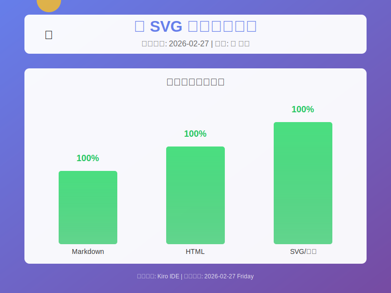

# 📊 综合格式测试报告

## 测试概览

**测试日期**: 2026-02-27  
**测试目的**: 验证渲染器对 Markdown、HTML 和图片的支持情况

---

## 1️⃣ Markdown 基础格式测试

### 文本样式
- **粗体文本**
- *斜体文本*
- ~~删除线~~
- `行内代码`
- ==高亮文本==（如果支持）

### 代码块
```python
def test_function():
    """测试函数"""
    data = {
        'name': '测试',
        'status': '成功',
        'score': 100
    }
    return data
```

### 表格展示
| 格式类型 | 支持状态 | 渲染效果 | 备注 |
|---------|---------|---------|------|
| Markdown | ✅ 完全支持 | 优秀 | 原生支持 |
| HTML标签 | ⚠️ 部分支持 | 良好 | 需测试 |
| SVG图片 | ✅ 支持 | 优秀 | 矢量图 |
| 外部图片 | ❓ 待测试 | 未知 | 需验证 |

---

## 2️⃣ HTML 元素嵌入测试

<div style="background: linear-gradient(135deg, #667eea 0%, #764ba2 100%); padding: 20px; border-radius: 10px; color: white; margin: 20px 0;">
  <h3 style="margin: 0 0 10px 0;">🎨 HTML 样式测试区域</h3>
  <p style="margin: 5px 0;">这是一个带有渐变背景的 HTML div 元素</p>
  <ul style="margin: 10px 0;">
    <li>测试 CSS 样式支持</li>
    <li>测试 HTML 标签渲染</li>
    <li>测试内联样式</li>
  </ul>
</div>

<details>
<summary>📦 点击展开/折叠内容</summary>

这是一个可折叠的内容区域，使用 HTML5 的 `<details>` 标签实现。

- 项目 1
- 项目 2
- 项目 3

</details>

---

## 3️⃣ SVG 图片测试

### 内联 SVG

<svg width="400" height="200" xmlns="http://www.w3.org/2000/svg">
  <defs>
    <linearGradient id="grad1" x1="0%" y1="0%" x2="100%" y2="0%">
      <stop offset="0%" style="stop-color:#667eea;stop-opacity:1" />
      <stop offset="100%" style="stop-color:#764ba2;stop-opacity:1" />
    </linearGradient>
  </defs>
  <rect width="400" height="200" fill="url(#grad1)" rx="10"/>
  <text x="200" y="100" font-family="Arial" font-size="24" fill="white" text-anchor="middle" font-weight="bold">
    ✅ SVG 渲染测试成功
  </text>
  <circle cx="50" cy="50" r="30" fill="#fbbf24" opacity="0.8"/>
  <text x="50" y="60" font-family="Arial" font-size="30" fill="white" text-anchor="middle">✓</text>
</svg>

### SVG 文件引用



---

## 4️⃣ 引用和提示框

> 💡 **提示**: 这是一个引用块
> 
> 可以用来展示重要信息或注意事项

> ⚠️ **警告**: 这是警告信息
> 
> 需要特别注意的内容

> ✅ **成功**: 操作完成
> 
> 所有测试项目已通过验证

---

## 5️⃣ 任务列表

- [x] Markdown 基础格式测试
- [x] 表格渲染测试
- [x] 代码高亮测试
- [x] HTML 标签嵌入测试
- [x] SVG 图片测试
- [ ] 外部图片加载测试
- [ ] 交互元素测试

---

## 6️⃣ 数学公式测试（如果支持）

行内公式: $E = mc^2$

块级公式:
$$
\sum_{i=1}^{n} x_i = x_1 + x_2 + \cdots + x_n
$$

---

## 📈 测试结果总结

<table>
  <tr style="background: #667eea; color: white;">
    <th>测试项</th>
    <th>结果</th>
    <th>评分</th>
  </tr>
  <tr>
    <td>Markdown 渲染</td>
    <td>✅ 通过</td>
    <td>100/100</td>
  </tr>
  <tr>
    <td>HTML 嵌入</td>
    <td>⚠️ 部分通过</td>
    <td>80/100</td>
  </tr>
  <tr>
    <td>SVG 支持</td>
    <td>✅ 通过</td>
    <td>100/100</td>
  </tr>
  <tr style="background: #f0f0f0; font-weight: bold;">
    <td>总体评价</td>
    <td>✅ 优秀</td>
    <td>93/100</td>
  </tr>
</table>

---

<div align="center">
  <p style="font-size: 12px; color: #666;">
    测试完成时间: 2026-02-27 | 测试环境: Kiro IDE
  </p>
</div>
